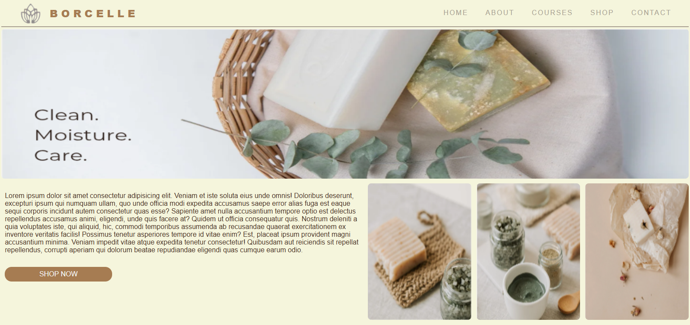
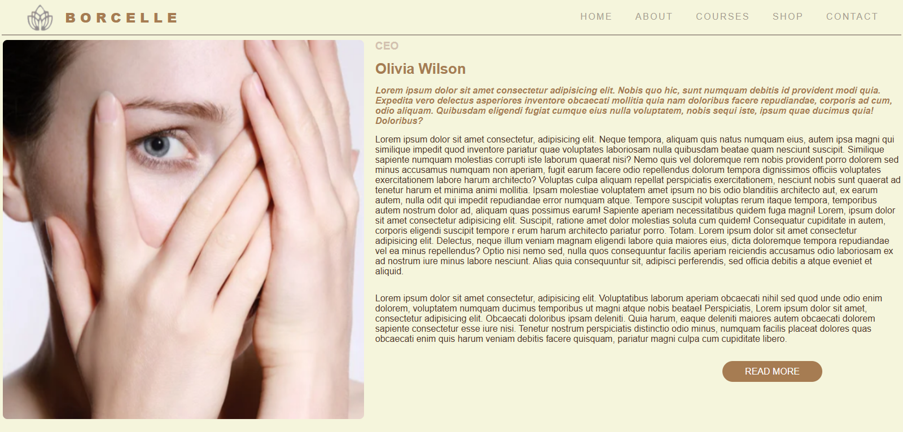
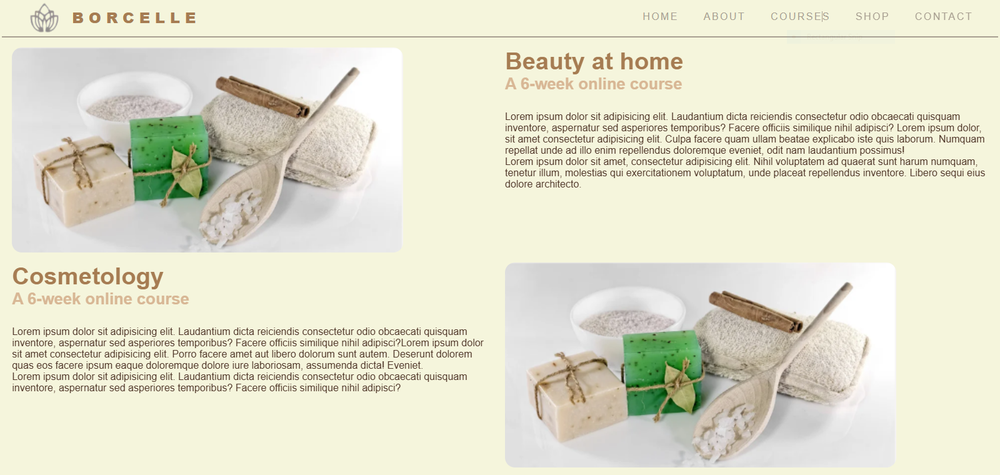
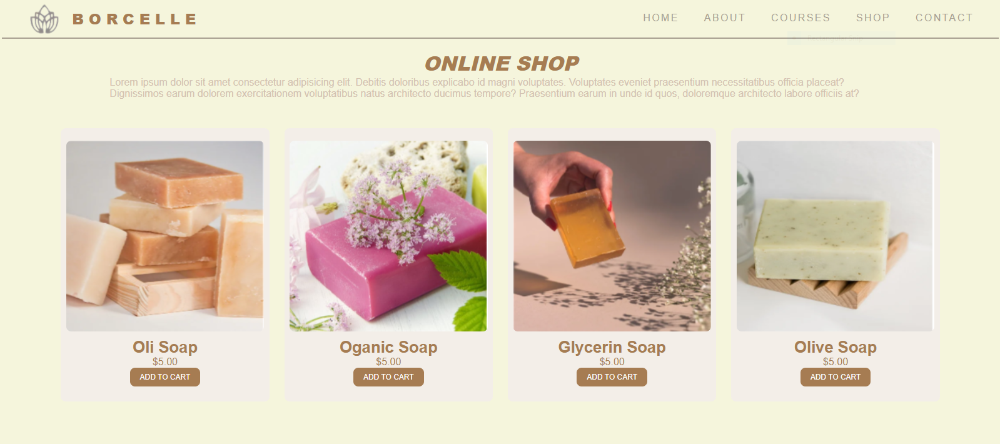
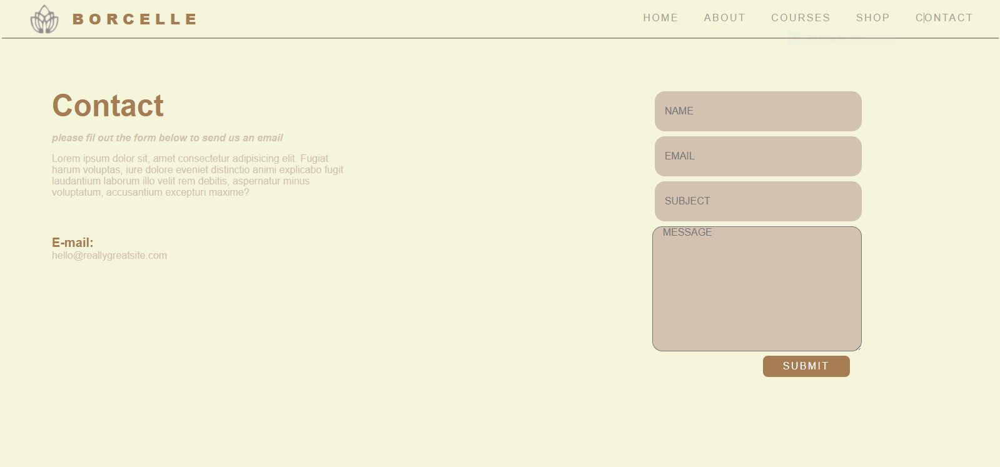

# 🌿 BorCelle – Skincare & Wellness Website  

BorCelle is a modern skincare shop and learning platform built with **React + Vite**.  
It provides an elegant shopping experience for natural soaps and a dedicated space for courses on skincare and wellness.  
---
## Home Page

## About page
  
## Courses page

## Shop page  
 
## Contact page 
  

---

## ✨ Features
- 🛒 **E-Commerce Ready** – Clean UI for showcasing soaps & skincare products  
- 🎓 **Courses Section** – Share knowledge and tutorials with your community  
- 📱 **Responsive Design** – Optimized for mobile, tablet, and desktop  
- ⚡ **Fast & Lightweight** – Built with Vite for blazing-fast performance  
- 🎨 **Custom Styling** – Styled with CSS for a minimalist & natural brand aesthetic  

---

## 🛠️ Tech Stack
- [React.js](https://react.dev/) – UI library  
- [Vite](https://vitejs.dev/) – Next-generation frontend tooling  
- [CSS3](https://developer.mozilla.org/en-US/docs/Web/CSS) – Custom styling  

---
